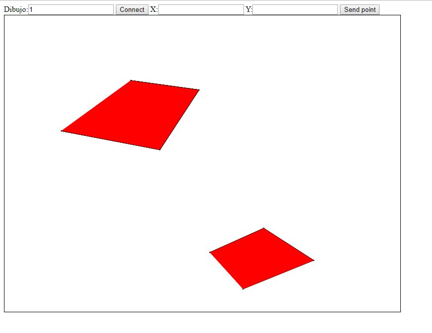

# Broker de Mensajes STOMP

## Compile and run instructions

#### Requisitos:

- Maven
- Java

#### Ejecucción

En el directorio `WEBSOCKETS_POINTS`:

- Para ejecutar el proyecto: `mvn spring-boot:run`

## FINAL

### Controller _STOMPMessagesHandler.js_

```java
@Controller
public class STOMPMessagesHandler {

    @Autowired
    SimpMessagingTemplate msgt;

    final ConcurrentHashMap<String, List<Point>> puntos = new ConcurrentHashMap<>();

    @MessageMapping("/newpoint.{numdibujo}")
    public void handlePointEvent(Point pt, @DestinationVariable String numdibujo) throws Exception {
        System.out.println("Nuevo punto recibido en el servidor!:" + pt + " idDibujo: " + numdibujo);
        if (puntos.containsKey(numdibujo)) {
            puntos.get(numdibujo).add(pt);
        } else {
            List<Point> temp = new ArrayList<Point>();
            puntos.put(numdibujo, temp);
            puntos.get(numdibujo).add(pt);
        }
        msgt.convertAndSend("/topic/newpoint." + numdibujo, pt);

        if (puntos.get(numdibujo).size() % 4 == 0) {
            msgt.convertAndSend("/topic/newpolygon." + numdibujo, puntos.get(numdibujo));
        }
    }
}
```

### Return _app.js_

```java
return {
    init: function() {
      app.disconnect();
      _clearCanvas();
      idDibujo = $("#dibujo").val();
      console.log(idDibujo);
      if (idDibujo) {
        //websocket connection
        connectAndSubscribe();
      }
    },
    mouseEvent: function() {
      var can = document.getElementById("canvas");
      can.addEventListener("pointerdown", function(evt) {
        var clickPosition = getMousePosition(evt);
        app.publishPoint(clickPosition.x, clickPosition.y);
      });
    },
    publishPoint: function(px, py) {
      if (idDibujo) {
        var pt = new Point(px, py);
        console.info("publishing point at " + pt);
        //addPointToCanvas(pt);
        //publicar el evento
        stompClient.send("/app/newpoint." + idDibujo, {}, JSON.stringify(pt));
      }
    },

    disconnect: function() {
      if (stompClient !== null) {
        stompClient.disconnect();
      }
      //setConnected(false);
      console.log("Disconnected");
    }
  };
```

### connectAndSubscribe _app.js_

```java
var connectAndSubscribe = function() {
    console.info("Connecting to WS...");
    var socket = new SockJS("/stompendpoint");
    stompClient = Stomp.over(socket);

    //subscribe to /topic/TOPICXX when connections succeed
    stompClient.connect({}, function(frame) {
      console.log("Connected: " + frame);
      //stompClient.subscribe("/topic/TOPICXX", function(eventbody) {});
      stompClient.subscribe("/topic/newpoint." + idDibujo, function(eventbody) {
        var theObject = JSON.parse(eventbody.body);
        //callback("New Point: " + theObject.x + " " + theObject.y);
        addPointToCanvas(new Point(theObject.x, theObject.y));
      });

      stompClient.subscribe("/topic/newpolygon." + idDibujo, function(
          eventbody
      ) {
        var theObject = JSON.parse(eventbody.body);
        addPolygonToCanvas(theObject);
      });
    });
  };
```

### addPolygonToCanvas _app.js_

```java
var addPolygonToCanvas = function (points) {
    var canvas = document.getElementById("canvas");
    var ctx = canvas.getContext("2d");
    var cont = 1;
    ctx.fillStyle = '#f00';
    ctx.beginPath();
    ctx.moveTo(points[0].x,points[0].y);
    points.filter((point,index) => {return index > 0}).map(function (point) {
      if (cont == 4){
        cont = 0;
        ctx.moveTo(point.x,point.y);
      }else{
        ctx.lineTo(point.x, point.y);
      }
      cont++;
      ctx.stroke();
    });
    ctx.closePath();
    ctx.fill();
  };
```

### Pagina


